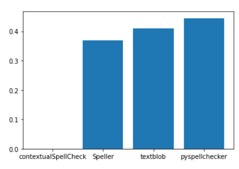

# Autocorrect-Methodologies-Evaluation

In this repository I worked on a word correction evaluation problem, so I selected four auto-correction well-known libraries and evaluated them on a dataset, the dataset has been tackled to tweak the words to generate some incorrect words, and the data generated by swapping, removing, and adding letters.

## Dataset
The error function:

```Python
def apply_error(word, remove=0.3, add=0.3, swap_letter=True):
  def swap(s, i, j):
    return ''.join((s[:i], s[j], s[i+1:j], s[i], s[j+1:]))

  if swap_letter:
    i = random.randint(0,len(word)-1)
    j = random.randint(0,len(word)-1)
    word = swap(word, i, j)

  letters_to_remove = int(remove*len(word))
  letters_to_add = int(add*len(word))

  for _ in range(letters_to_remove):
    i = random.randint(1,len(word))
    word = word[:i-1] + word[i:]

  lower_upper_alphabet = string.ascii_letters
  for _ in range(letters_to_add):
    random_letter = random.choice(lower_upper_alphabet)
    i = random.randint(1,len(word))
    word = word[:i] + random_letter.lower() + word[i:]

  return word
```

The deviated words:

|     | correct     | wrong_1       |
|:----|:------------|:--------------|
| 0   | perpetrated | perpetrated   |
| 1   | hazard      | hazaard       |
| 2   | abandon     | abandaondon   |
| 3   | driven      | drirviven     |
| 4   | allow       | allllow       |
| ... | ...         | ...           |
| 195 | shamed      | smahed        |
| 196 | singular    | singulnagular |
| 197 | cabinet     | cabinaebinet  |
| 198 | righteous   | rightheteous  |
| 199 | requires    | reruiqes      |

## Models comparison
The used models:
- contextualSpellCheck
- textblob
- pyspellchecker
- autocorrect (Speller)

**The model's accuracies:**




## The word correction of the best model

|     | correct     | wrong_1       | pyspellcheckerOutput  |
|:----|:------------|:--------------|:----------------------|
| 0   | perpetrated | perpetrated   | perpetrated           |
| 1   | hazard      | hazaard       | hazard                |
| 2   | abandon     | abandaondon   | abandaondon           |
| 3   | driven      | drirviven     | drirviven             |
| 4   | allow       | allllow       | allow                 |
| ... | ...         | ...           | ...                   |
| 195 | shamed      | smahed        | smashed               |
| 196 | singular    | singulnagular | singulnagular         |
| 197 | cabinet     | cabinaebinet  | cabinaebinet          |
| 198 | righteous   | rightheteous  | rightheteous          |
| 199 | requires    | reruiqes      | requires              |